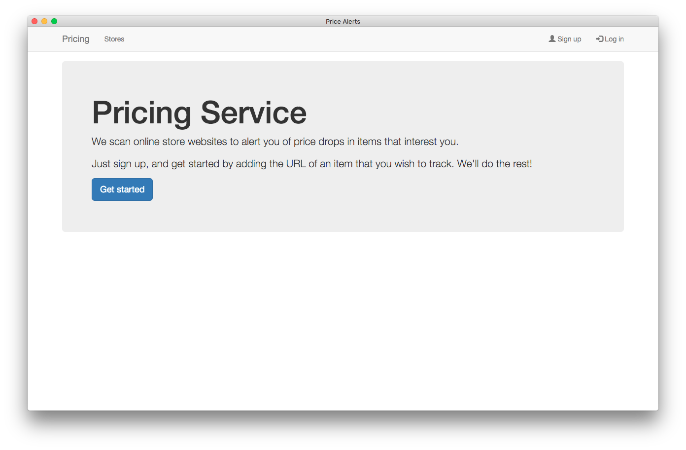
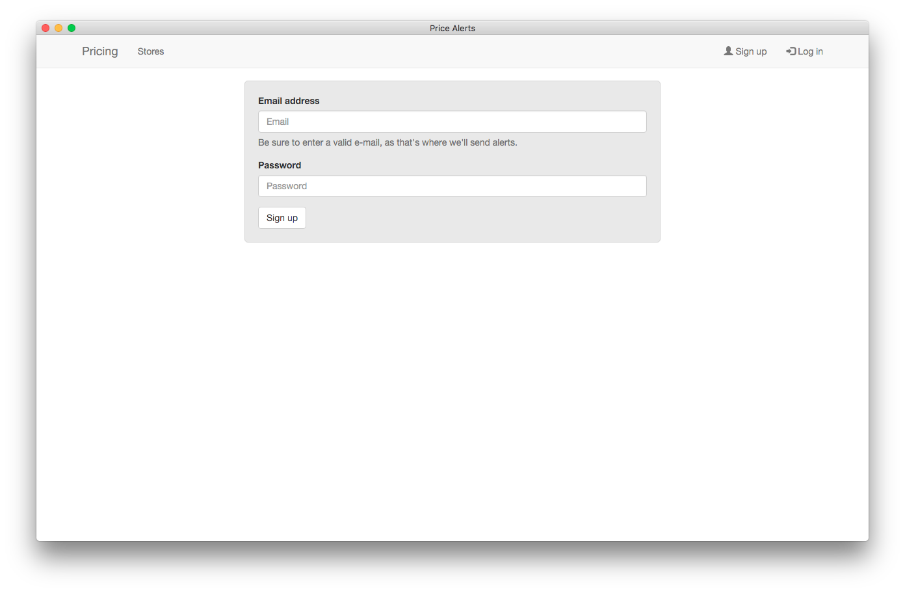
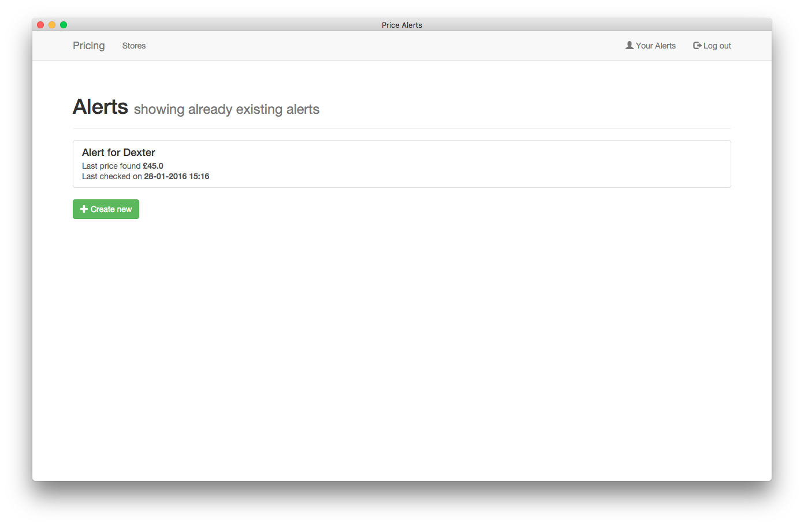
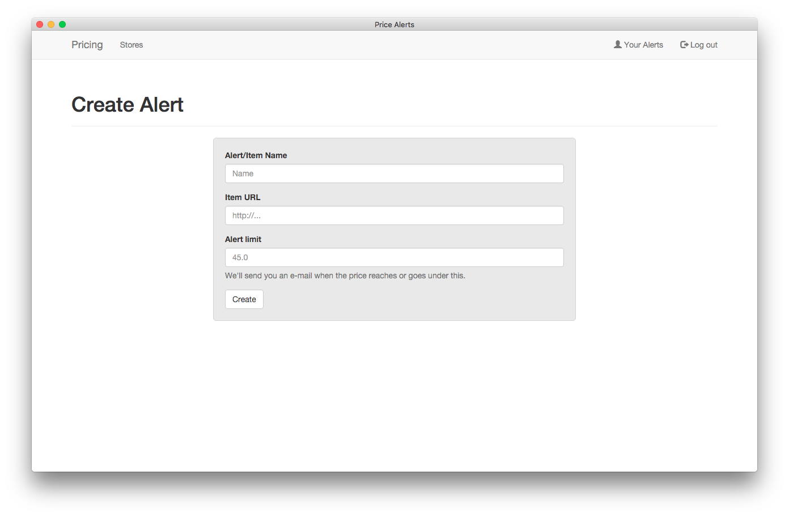
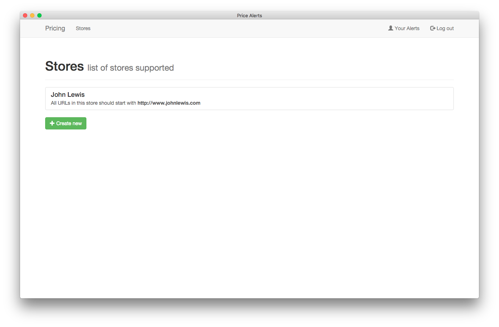
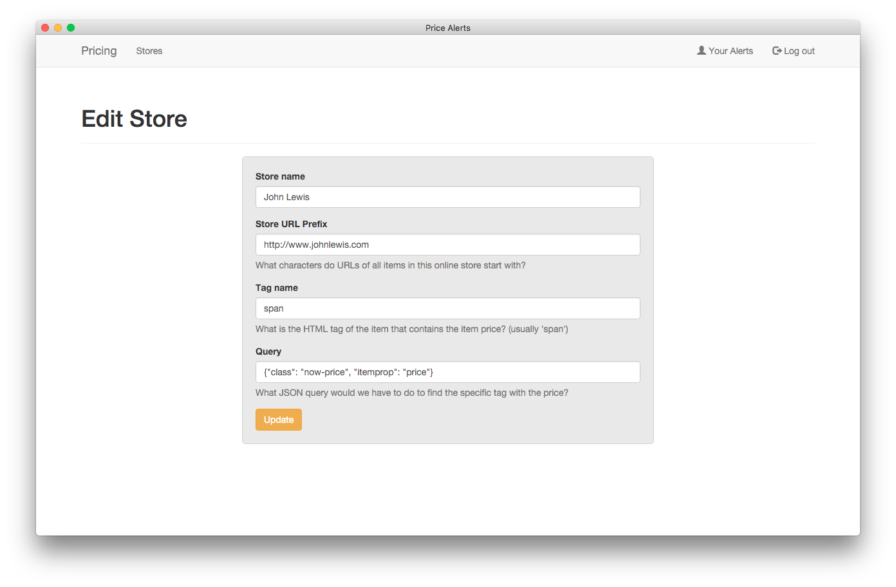

# Pricing Service

This is an application built to allow the periodic scanning of online webstores, to notify users of changes in prices of items they select.

This application is part of the course "The Complete Python Web Developer", a course aimed at beginners, to teach the creation of web applications using Python. If that sounds interesting, check it out: https://www.udemy.com/the-complete-python-web-course-learn-by-building-8-apps/

It allows administrators (defined via `src/config.py`) to add, remove, and edit online stores.

You will need a Mailgun account and API details for the e-mailing to work.
E-mails are sent via executing the `src/alert_updater.py` file. In order to check e.g. every 10 minutes, the file must be executed every 10 minutes. This can be done with a cron job or a Windows service.

It parses the store websites using `requests` and `BeautifulSoup`.

It **does not work with Stores that dynamically inject content using JavaScript**.

It allows users to register, log in, and create and modify their alerts.

Technology stack: MongoDB, Python (Flask & Jinja2), HTML/CSS/Bootstrap, Mailgun.

## Installation

1. Clone the repository (going to a terminal and run `git clone git@github.com:schoolofcode-me/price-of-chair.git`.
2. Define your administrator e-mail in `src/config.py`.
3. Define your Mailgun API details on `src/models/alerts/constants.py`.
4. Create a virtual environment for the repository (run `virtualenv --python=python3.5 venv`)
5. Run the Flask server by executing `venv/bin/python price-of-chair/src/run.py`.
6. Whenever you want to check prices of items (**caution: can take a long time if you have a lot of items!**), run `venv/bin/python price-of-char/src/alert_updater.py`.

